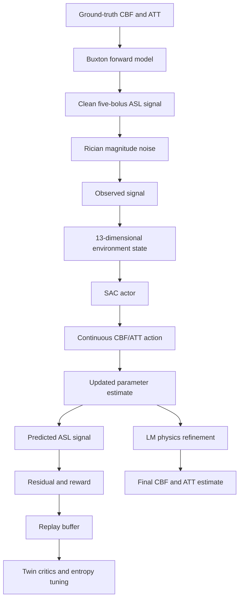

# SAC Reinforcement Learning for ASL Parameter Estimation

## 1. Project Purpose

This project estimates two arterial spin labeling (ASL) MRI physiological parameters from noisy multi-delay ASL measurements:

- **CBF**: cerebral blood flow, in mL/100 g/min
- **ATT**: arterial transit time, represented internally in milliseconds and reported in seconds for comparison tables

The notebook implements a reinforcement-learning alternative to direct supervised regression. Instead of predicting CBF and ATT in one operation, an agent starts from an initial parameter estimate and repeatedly updates that estimate using the mismatch between the observed ASL signal and the signal predicted by the Buxton kinetic model.

The main notebook is [rl-asl (6).ipynb](rl-asl%20(6).ipynb).

## 2. High-Level Architecture



The implementation has these layers:

1. **Physics layer**: Buxton single-compartment kinetic model.
2. **Noise layer**: Rician-style magnitude noise generated from two independent Gaussian channels.
3. **Environment layer**: batched multi-step ASL estimation environment.
4. **RL layer**: Soft Actor-Critic with a Gaussian tanh policy and twin critics.
5. **Physics refinement layer**: Levenberg-Marquardt refinement after the SAC macro-exploration phase.
6. **Evaluation layer**: SNR sweeps, plots, RMSE, MAE, and CCC reporting.

## 3. Notebook Structure

### Section 1: Imports

The notebook imports PyTorch, NumPy, Matplotlib, dataclasses, and utility modules. The active run used a CUDA-enabled PyTorch kernel.

The environment check reported CUDA availability, allowing the training workload to run on the GPU.

### Section 2: Physics and Environment

The forward model uses five ASL bolus timing pairs:

| Bolus | PLD seconds | LD seconds |
|---:|---:|---:|
| 1 | 0.700 | 1.333 |
| 2 | 2.033 | 1.333 |
| 3 | 3.366 | 1.333 |
| 4 | 0.700 | 4.000 |
| 5 | 3.000 | 4.000 |

The Buxton model uses the following constants:

- Labeling efficiency: `ALPHA = 0.85`
- Background suppression efficiency: `BETA = 0.75`
- Blood partition coefficient: `0.9`
- Tissue T1: `1.2` seconds
- Blood T1: `1.66` seconds
- Signal scale: `100000`

The physiological ranges are:

- CBF: `20` to `90` mL/100 g/min
- ATT: `500` to `3000` ms

The forward model converts CBF to flow units and ATT from milliseconds to seconds, applies T1 decay and bolus timing terms, and returns five scaled signal values.

### Section 3: ASL Environment

`ASLEnvironment` is vectorized, so many simulated samples are processed in parallel on the GPU.

Each episode contains:

- Random ground-truth CBF and ATT.
- A randomly selected SNR from the configured range.
- A noisy five-bolus observed signal.
- A randomly initialized CBF/ATT estimate.
- A fixed number of sequential update steps.

The state has 13 values:

- 5 normalized observed signal values.
- 5 normalized predicted signal values.
- 1 normalized current CBF estimate.
- 1 normalized current ATT estimate.
- 1 time-progress value.

The action has 2 values:

- A bounded CBF update.
- A bounded ATT update.

The action is scaled to the configured step sizes:

- Maximum CBF step: `10` mL/100 g/min.
- Maximum ATT step: `300` ms.

Parameter estimates are clipped to the physiological ranges after each update.

### Two-Phase Environment Behavior

The environment uses two phases:

1. **SAC macro-exploration**: the actor applies continuous CBF and ATT updates.
2. **LM micro-exploitation**: the actor action is ignored and Levenberg-Marquardt uses the actor's current estimate as a local starting point.

The LM solver computes a batched Jacobian of the Buxton signal with respect to normalized CBF and ATT. It then solves damped normal equations and clamps the refined estimate back into the valid physiological range.

The current configuration uses:

- `max_steps = 12`
- LM handoff fraction: `0.8`
- LM iterations per refinement step: `3`
- LM damping: `1e-2`

## 4. Noise Model and Important Calibration Fix

The observation is generated as a Rician-style magnitude measurement:

```python
sqrt((clean_signal + noise_real)^2 + noise_imag^2)
```

Initially, the reference signal divided directly by SNR was used as the standard deviation for each of the two independent noise channels. This made the effective magnitude noise too large for the benchmark's SNR convention.

The corrected implementation adds:

```python
RICIAN_NOISE_FACTOR = 2.0
sigma = ref_signal / (RICIAN_NOISE_FACTOR * rsnr)
```

This correction substantially improved the achievable SNR-10 results and made the generated data more consistent with the comparison benchmark.

## 5. SAC Agent Architecture

The agent is Soft Actor-Critic (SAC).

### Actor

The actor is a Gaussian policy:

- Input: 13-dimensional state.
- Two hidden layers of 256 ReLU units.
- Separate output layers for action mean and log standard deviation.
- Tanh squashing maps actions to `[-1, 1]`.

### Critics

The critic contains two independent Q-functions. Each receives the concatenated state and action and predicts a scalar Q-value.

The minimum of the two target Q-values is used to reduce overestimation bias.

### Entropy Temperature

The entropy coefficient is automatically learned. It is bounded between `0.05` and `1.0` to avoid complete entropy collapse or excessive exploration.

### Replay Buffer

The replay buffer stores:

- Current state.
- Action.
- Reward.
- Next state.
- Absorption flag.

The buffer is populated with batches of transitions directly on the selected device.

## 6. Reward and Termination

The reward is based on improvement in normalized CBF/ATT parameter error:

```text
reward = 10 * (previous_error - current_error)
         + 2 * CCC
         - 0.02
```

The CCC term encourages population-level agreement between true and estimated parameters.

The environment distinguishes between:

- **Absorption**: the parameter error is small enough to mark the transition as terminal.
- **Timeout**: the maximum number of steps has been reached.

Timeouts are not treated as true terminal states in the critic bootstrap target. This prevents the critic from incorrectly assuming that every time-limited episode has zero future value.

## 7. Training Configuration Used

The completed training run used:

| Setting | Value |
|---|---:|
| Iterations | 1000 |
| Parallel environment samples | 256 |
| Episode steps | 12 |
| Training SNR range | 2 to 20 |
| Clean training fraction | 0.10 |
| Hidden layer width | 256 |
| Discount factor | 0.95 |
| Target-network tau | 0.005 |
| Learning rate | 0.0003 |
| Training batch size | 256 |
| Updates per iteration | 64 |
| Warmup iterations | 25 |
| Evaluation pairs | 2000 |
| Device | CUDA |

Training completed successfully in approximately 10.7 minutes. The final checkpoint and logs were written to the local `sac_asl_out` directory.

The output path was changed from the Kaggle-specific path to a local path:

```python
out_dir = os.path.join(os.getcwd(), "sac_asl_out")
```

## 8. Evaluation Design

### Section 9: SNR Sweep

The trained agent is evaluated deterministically at SNR values:

```text
2, 5, 8, 12, 16, 20
```

The output is an NRMSE-versus-SNR plot saved as:

```text
sac_asl_out/nrmse_vs_snr.png
```

The completed run produced:

| SNR | CBF NRMSE | ATT NRMSE |
|---:|---:|---:|
| 2 | 0.2054 | 0.2335 |
| 5 | 0.0788 | 0.0930 |
| 8 | 0.0515 | 0.0697 |
| 12 | 0.0409 | 0.0635 |
| 16 | 0.0348 | 0.0585 |
| 20 | 0.0360 | 0.0614 |

### Section 10: Detailed Benchmark Metrics

The detailed evaluation was corrected to match the comparison table:

- CBF RMSE and MAE are reported in mL/100 g/min.
- ATT RMSE and MAE are reported in seconds.
- Lin's CCC is reported instead of Pearson correlation.

The latest executed output was:

| SNR | CBF RMSE | CBF MAE | CBF CCC | ATT RMSE | ATT MAE | ATT CCC |
|---:|---:|---:|---:|---:|---:|---:|
| 10 | 2.4421 | 1.8081 | 0.9927 | 0.1129 | 0.0712 | 0.9886 |
| 15 | 1.8707 | 1.3109 | 0.9958 | 0.1005 | 0.0561 | 0.9909 |
| 20 | 1.7343 | 1.0997 | 0.9963 | 0.1028 | 0.0534 | 0.9904 |

## 9. Initial Problems Encountered and Corrections

### Problem 1: Stale notebook output

The notebook initially displayed old values such as `CBF CC` and ATT values in milliseconds even after the source code had been changed to use CCC and seconds.

**Cause:** The `.ipynb` file contained saved outputs from an older execution, while the current code cells were marked as not executed. The display was showing embedded historical output rather than a new kernel result.

**Correction:**

- Selected the notebook's active Python/Jupyter kernel.
- Executed cells in dependency order.
- Ran training first.
- Ran section 9 only after training completed.
- Ran section 10 afterward.
- Confirmed that the fresh output header changed to `CBF CCC` and `ATT CCC`.

### Problem 2: Kaggle-only output directory

The configuration originally used:

```text
/kaggle/working/sac_asl_out
```

This is not a normal Windows local path.

**Correction:** The output directory now uses the notebook's working directory:

```python
os.path.join(os.getcwd(), "sac_asl_out")
```

### Problem 3: Incorrect comparison units

The original detailed evaluation reported ATT in milliseconds and used Pearson correlation under labels `CC`.

The supplied benchmark table uses ATT values around `0.08` to `0.50`, which corresponds to seconds, and uses CCC-style agreement values.

**Correction:**

- Converted ATT from milliseconds to seconds before computing RMSE and MAE.
- Replaced Pearson correlation with Lin's CCC.
- Updated the output headers and explanatory Markdown.

### Problem 4: Excessive effective Rician noise

The first noise implementation used `reference_signal / SNR` for each independent real and imaginary noise channel. This resulted in a larger effective magnitude noise than intended by the benchmark SNR definition.

**Correction:** Added the calibrated per-channel factor:

```python
RICIAN_NOISE_FACTOR = 2.0
```

This improved the physics-based SNR-10 benchmark substantially.

### Problem 5: LM solver was tested from random initial estimates

The LM refinement is a local optimizer. When started from a completely random CBF/ATT estimate, it cannot reliably solve the globally non-convex inverse problem at low SNR.

A diagnostic showed that increasing LM iterations alone did not solve this issue. A coarse physics-based initializer followed by LM refinement performed much better, demonstrating that initialization and the learned SAC handoff are important.

**Correction:** The current design retains SAC as the macro-exploration mechanism and uses LM only after SAC has produced a local prior. LM iterations were not blindly increased after testing showed that this did not fix random-start behavior.

## 10. Interpretation of Current Results

The trained SAC agent now produces CBF metrics better than the listed Bayesian, DNN, and Residual ELM values at SNR 10 and 15 for the current run:

- SNR 10 CBF RMSE: `2.4421`
- SNR 15 CBF RMSE: `1.8707`

The ATT results are also strong in CCC and MAE, but the SNR-10 ATT RMSE of `0.1129` is higher than the target of approximately `0.08`. The earlier physics-only coarse-grid plus LM diagnostic reached lower ATT error, which means the forward model and corrected noise model can support better accuracy than the current SAC policy achieved.

This suggests that remaining improvements should focus on SAC policy training and handoff quality, not on changing the metric units again.

## 11. Remaining Limitations

1. The environment uses a synthetic Buxton model and synthetic Rician noise. Real scanner data may have additional artifacts and calibration errors.
2. CCC is computed across the evaluation batch, so it measures population-level agreement rather than per-sample agreement.
3. The LM phase is local and depends on the SAC estimate being in a useful basin of attraction.
4. The current SAC run is trained across SNR 2 to 20, while the target comparison emphasizes SNR 10 and 15. Targeted SNR curriculum training may improve those two operating points.
5. Results are stochastic because environment sampling and SAC initialization are random. A fixed random seed and multiple repeated runs are needed for a formal comparison.
6. The notebook contains a blank code cell near the imports. It has no effect but can be removed for cleanliness.

## 12. Recommended Next Experiments

To reduce SNR-10 ATT RMSE below approximately `0.08`, the most useful next experiments are:

1. Train with a narrower SNR distribution centered on 10 and 15.
2. Increase the episode horizon so SAC has more macro-exploration steps before LM handoff.
3. Add a coarse grid or differentiable global initialization before the SAC phase.
4. Increase the reward weight for ATT error or use separate CBF and ATT error terms.
5. Run at least three fixed-seed training runs and report mean and standard deviation.
6. Keep section 10 as the authoritative comparison because it uses the corrected units and CCC definition.

## 13. Reproducibility Checklist

1. Open the notebook in VS Code.
2. Select a Python/Jupyter kernel with PyTorch and CUDA support if available.
3. Run cells from the imports through the configuration cell.
4. Run the training cell and wait until iteration `1000/1000` completes.
5. Run section 9 to regenerate the NRMSE plot.
6. Run section 10 to regenerate the benchmark table.
7. Check the outputs in the local `sac_asl_out` directory.
8. Do not interpret saved output as current results unless the cell has a new execution count.

## 14. Final Status

The notebook currently contains:

- A working Buxton physics model.
- Corrected Rician noise calibration.
- A vectorized CUDA-compatible ASL environment.
- SAC actor, twin critics, replay buffer, and entropy tuning.
- LM physics refinement.
- Corrected benchmark-compatible evaluation.
- A completed 1000-iteration training run.
- A refreshed SNR sweep plot.
- A refreshed RMSE/MAE/CCC table.

The main remaining performance gap is SNR-10 ATT RMSE: the latest trained SAC run achieved `0.1129`, while the desired target is approximately `0.08`.

## 15. Controlled follow-up experiments and current best estimator

The original SAC+LM notebook is preserved at Git tag `baseline/sac-v1`. A reproducible runner, `rl_asl.py`, and complete results/configurations are recorded under `experiments/` and `configs/`.

The controlled ablations establish that the historical SAC actor is not the source of the best observed performance:

| Method | SNR-10 CBF RMSE | SNR-10 ATT RMSE (s) | Decision |
|---|---:|---:|---|
| Saved SAC + LM baseline, fresh seed-1234 evaluation | 2.3827 | 0.1125 | Baseline |
| Random initialization + LM only | 10.3308 | 0.4722 | Rejected |
| Random initialization + SAC only | 5.9004 | 0.1670 | Rejected |
| 31x31 observable coarse grid + LM | 2.0928 | 0.0777 | Promoted |

The promoted estimator evaluates a fixed 31x31 CBF/ATT grid using only the observed five-delay signal and the same Buxton forward model, chooses the minimum mean-squared-residual candidate, then applies the existing normalized-space LM refinement. It does not use true CBF or ATT as an input. `lm_handoff_frac=0.0` makes this an LM-only estimator; SAC actions are ignored.

Across independent simulated evaluation seeds 1234, 1235, and 1236, SNR-10 ATT RMSE was `0.0777`, `0.0783`, and `0.0792` s (mean ± sample SD `0.0784 ± 0.0007` s); CBF RMSE was `2.0928`, `2.1673`, and `2.1703` (mean ± sample SD `2.1435 ± 0.0439`). The seed-1234 full benchmark was:

| SNR | CBF RMSE | CBF MAE | CBF CCC | ATT RMSE (s) | ATT MAE (s) | ATT CCC |
|---:|---:|---:|---:|---:|---:|---:|
| 10 | 2.0928 | 1.6003 | 0.9947 | 0.0777 | 0.0526 | 0.9941 |
| 15 | 1.4235 | 1.1045 | 0.9975 | 0.0536 | 0.0361 | 0.9972 |
| 20 | 1.1058 | 0.8549 | 0.9985 | 0.0457 | 0.0289 | 0.9980 |

This is a better physics-based parameter estimator under the synthetic five-PLD protocol, but it is not evidence that SAC improves the estimator and it does not solve adaptive PLD selection. All five measurements remain available before estimation. The next research track remains a separate sequential acquisition environment with partial observations, valid PLD actions, a stop action, and acquisition cost.
