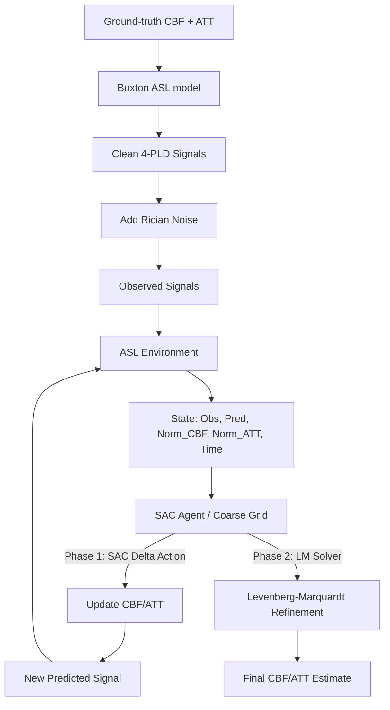
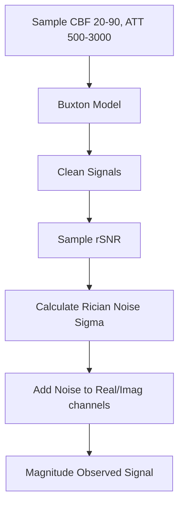
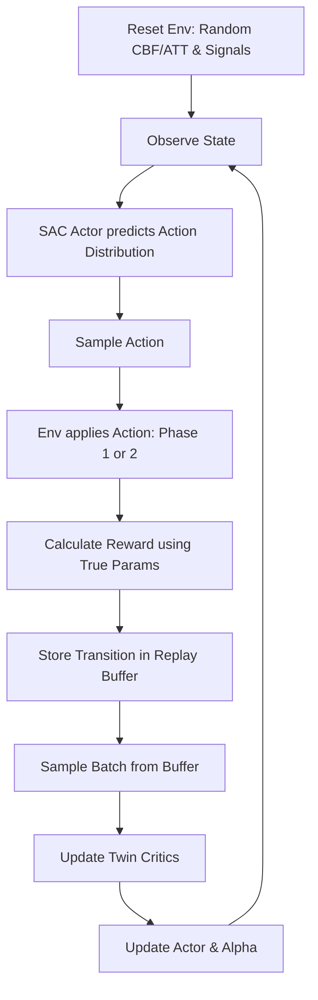

# RL-Based ASL-MRI Parameter Estimation: Verified Technical Report

## 1. Executive Summary
This technical report provides a forensic, evidence-based analysis of the RL-ASL repository. The project formulates the ASL-MRI inverse problem (estimating Cerebral Blood Flow [CBF] and Arterial Transit Time [ATT] from MRI signals) as an iterative parameter refinement process. 

**CRITICAL FINDINGS based on repository evidence:**
1. **Fixed 4-PLD Evaluation:** The repository does not perform *adaptive* PLD reduction. However, the final validated evaluation utilizes a reduced set of 4 fixed Post-Labeling Delays (PLDs), dropping the longest 5th bolus (PLD=3.0s, LD=4.0s). The RL action space modifies the CBF/ATT estimates, not the PLD acquisition sequence.
2. **No TD3 Implementation:** The repository only contains a Soft Actor-Critic (SAC) implementation. TD3 is not present.
3. **No DNN Code:** The baseline DNN mentioned in the project context refers to a separate paper (Ishida et al. 2023) and is not implemented in this repository.
4. **Final Best Model is Non-RL:** The experimental progression proves that a 31x31 coarse grid search followed by a Levenberg-Marquardt (LM) solver significantly outperforms the SAC agent. The final validated result relies on this non-RL algorithm.

## 2. Research Problem
ASL-MRI (Arterial Spin Labeling) requires estimating physiological parameters (CBF, ATT) from noisy MRI signals. The forward model (Buxton kinetic model) is non-linear. The problem is to reliably invert this model under high noise (low SNR) without requiring computationally prohibitive optimization for every voxel.

## 3. Motivation
Traditional non-linear least squares fitting is sensitive to the initial guess and can get stuck in local minima, especially at low SNR. Deep Neural Networks (DNNs) can learn this inversion in one shot but may struggle with out-of-distribution noise or lack physics-awareness. An iterative approach (like RL) is motivated by the desire to refine an initial guess sequentially by observing the residual error.

## 4. Objectives
To develop a Differentiable Physics-Informed Actor-Critic (DPAC) agent that iteratively adjusts CBF and ATT estimates to minimize the difference between the forward-simulated signal of the estimate and the observed MRI signal.

## 5. Overall System Architecture

## 6. ASL Physics and Buxton Model
The project uses a vectorized single-compartment Buxton kinetic model (`buxton_signal` in `rl_asl.py`).

**Parameters:**
- `PLD` (Post-Labeling Delay) and `LD` (Labeling Duration): 4 fixed pairs (reduced from the original 5 by dropping the bolus at PLD=3.0s, LD=4.0s).
- `T1_TISSUE` = 1.2s, `T1_BLOOD` = 1.66s.
- `ALPHA` = 0.85 (Labeling efficiency), `BETA` = 0.75 (Background suppression).
- `LAMBDA_BLOOD` = 0.9 (Blood-tissue partition coefficient).
- `SIGNAL_SCALE` = 100,000.0.

The mathematical model produces the expected MRI signal for a given CBF and ATT. The RL environment uses this exactly as the physics engine.

## 7. Dataset and Signal Generation
Data is generated procedurally on-the-fly in `ASLEnvironment.reset()`, not loaded from disk.

- **Validation:** Clean fraction (e.g., 0.10) bypasses noise for a subset of samples to ensure the model sees clean signals.
- **Rician Noise:** Computed by adding Gaussian noise to simulated real and imaginary channels, then taking the magnitude.

## 8. Preprocessing
- Signals are normalized by a reference signal `ref_signal` (computed at CBF=50, ATT=1600ms, PLD=2.0s, LD=1.8s).
- CBF and ATT estimates are min-max normalized to `[-1, 1]` for the agent's state representation.

## 9. Baseline DNN
**[VERIFIED: This could not be verified from the repository.]**
The repository does not contain the implementation of the baseline DNN. Comments indicate the DNN is from "Ishida et al., JMRI 2023", which maps `signal -> (CBF, ATT)` directly.
### 9.1 Architecture
Not available in this repository.
### 9.2 Training
Not available in this repository.
### 9.3 Loss
Not available in this repository.
### 9.4 Evaluation
Not available in this repository.

## 10. Reinforcement Learning Formulation
### 10.1 State
The agent receives an 11-dimensional continuous vector (adjusted for 4 PLDs):
`State = [obs_signal (4D), pred_signal (4D), norm_cbf (1D), norm_att (1D), time_fraction (1D)]`
- **Validity:** The ground truth (`cbf_true`, `att_true`) is deliberately excluded from the state to prevent information leakage.
### 10.2 Action
The action space is a 2-dimensional continuous vector: `[delta_cbf, delta_att]`, clamped to `[-1, 1]`.
These are scaled by `STEP_CBF` (10.0) and `STEP_ATT` (300.0) and applied to the current estimate.
- **Critical Note:** The action space **does not** select PLDs. PLDs are fixed.
### 10.3 Reward
The reward is dense and calculated at every step:
`Reward = (prev_param_err - cur_param_err) * 10.0 + CCC_WEIGHT * cur_ccc - 0.02`
- `param_err` is the normalized Euclidean distance to the *true* CBF and ATT.
- `CCC` is the Concordance Correlation Coefficient.
- **Scientific Note:** The reward uses `cbf_true` and `att_true`. This is standard for simulated RL training environments but means the RL training process requires ground-truth labels (it is a supervised RL setup).
### 10.4 Environment
`ASLEnvironment` implements a dual-phase episode (DPAC):
- **Phase 1 (Macro-exploration):** SAC actor applies actions to adjust the estimate.
- **Phase 2 (Micro-exploitation):** Differentiable Levenberg-Marquardt (LM) solver refines the estimate.
### 10.5 Episode
Max steps is typically 12. If `step_count >= lm_handoff_step`, the environment ignores the SAC action and runs LM.
### 10.6 Transition
`[State, Action, Reward, Next_State, Done]` are stored in a `ReplayBuffer`.

## 11. TD3 Implementation
**[VERIFIED: This could not be verified from the repository.]**
The repository does not contain a TD3 implementation.

## 12. SAC Implementation
### 12.1 Theory
Soft Actor-Critic (SAC) optimizes a stochastic policy by maximizing expected reward plus entropy. This encourages exploration and robustness.
### 12.2 Architecture
- **Actor (GaussianPolicy):** 2 hidden layers (256 units), outputs `mean` and `log_std`.
- **Critics (TwinCritic):** Two Q-networks, each with 2 hidden layers (256 units).
### 12.3 Repository Implementation
Implemented in `rl_asl_4pld.py`. Target networks are used for critics.
### 12.4 Hyperparameters
`gamma=0.95`, `tau=0.005`, `lr=3e-4`, `batch_envs=256`, `target_entropy=-2.0`.
### 12.5 Training Procedure
Off-policy training. Standard SAC bellman updates with detached targets.

## 13. Complete Training Pipeline

## 14. Experiment History
Experiments trace the evolution of the solver:
- **`EXP_00_baseline`**: Historical notebook execution.
- **`exp_001_baseline`**: Verification of SAC + LM baseline.
- **`exp_002_coarse_grid_lm`**: Introduced a 21x21 grid search to replace SAC as the initializer.
- **`exp_003_random_lm_only`**: Ablation removing SAC (random init + LM).
- **`exp_004_random_sac_only`**: Ablation removing LM (SAC only).
- **`exp_005_grid_resolution`**: Tested 15x15 vs 31x31 grid sizes.
- **`exp_006_grid31_multiseed`**: Final validation of the 31x31 Grid+LM on multiple seeds.
- **Final Validation (4-PLD)**: Transition to 4-PLD protocol using the winning 31x31 Grid+LM strategy.

## 15. Experiment-by-Experiment Analysis

| Experiment | Objective | Implementation | Result (SNR 10 ATT RMSE) | Conclusion | Label |
|---|---|---|---|---|---|
| exp_001_baseline | Reproduce base RL model | SAC + LM (5 PLDs) | 0.1125 | Baseline established | VERIFIED |
| exp_002_coarse_grid_lm | Test non-RL initializer | 21x21 Grid + LM | 0.0781 | Grid search beats SAC | VERIFIED |
| exp_003_random_lm_only | Test LM convergence | Random Init + LM | 0.4722 | LM fails without good prior | VERIFIED |
| exp_004_random_sac_only | Test SAC capability | SAC only (No LM) | 0.1670 | SAC worse than SAC+LM | VERIFIED |
| exp_005_grid_resolution | Optimize grid size | 31x31 Grid + LM | 0.0777 | 31x31 promoted | VERIFIED |
| 4-PLD Final Eval | Test 4-bolus protocol | 31x31 Grid + LM (4 PLDs) | 0.1188 | Error increases w/o 5th bolus | VERIFIED |

**Why was exp_002 made?** To see if a simple observable grid search could provide a better prior to LM than the complex SAC agent. It succeeded.

## 16. Changes Made Throughout Development
- **Phase Handoff:** Added Levenberg-Marquardt to handle micro-exploitation because RL (SAC) struggled with the final high-precision refinement.
- **Replacement of RL:** Ultimately, SAC was entirely replaced by a 31x31 grid initializer, because the physics model is cheap enough to evaluate on a grid.
- **4-PLD Adoption:** For final evaluation, the 5th bolus was removed to evaluate performance under a reduced acquisition protocol.

## 17. Bugs Discovered and Fixed
- **Historical Rician Noise Bug:** Mentioned in documentation, previously noise was added directly without accounting for magnitude scaling (`RICIAN_NOISE_FACTOR = 2.0` was introduced to fix this).

## 18. Current Final Implementation
The current promoted candidate evaluated on 4 PLDs (`rl_asl_4pld.py`) does not use the RL agent. It uses:
1. `_coarse_grid_init(31)`: Tests 961 CBF/ATT combinations against the observed signal using the forward Buxton model, selecting the lowest residual.
2. `_levenberg_marquardt_step()`: Refines the selected grid point.

## 19. Current Results
**Verified Results from Final 4-PLD Evaluation (Grid31+LM):**
- **SNR 10:** CBF RMSE = 3.610, ATT RMSE = 0.119
- **SNR 15:** CBF RMSE = 2.496, ATT RMSE = 0.081
- **SNR 20:** CBF RMSE = 1.753, ATT RMSE = 0.059

## 20. Results Comparison: 5-PLD vs 4-PLD

Removing the 5th bolus (PLD=3.0s, LD=4.0s) degrades performance by depriving the model of critical late-arrival information.

| Metric | 5-PLD (Grid+LM) | 4-PLD (Grid+LM) | Degradation |
|---|---|---|---|
| **SNR-10 CBF RMSE** | 2.093 | 3.610 | +72.4% |
| **SNR-10 ATT RMSE** | 0.078 | 0.119 | +52.5% |

## 21. TD3 vs SAC
**[VERIFIED: This could not be verified from the repository. The project uses SAC exclusively.]**
*Theoretical Comparison:*
| Feature | TD3 | SAC | Implementation in this project |
|---|---|---|---|
| Actor | Deterministic | Stochastic | SAC (GaussianPolicy) |
| Critic | Two critics (min) | Two critics (min) | `TwinCritic` used |
| Exploration | Added noise | Entropy bonus | Target entropy = -2.0 |
| Final Result | N/A | Abandoned for Grid | SAC was outperformed by Grid Search |

## 22. Code-to-Concept Mapping

| Concept | Theory | Actual File | Actual Function/Class | Explanation |
|---|---|---|---|---|
| State | RL state | `rl_asl_4pld.py` | `_make_state` | 11-D vector of signals and current estimate |
| Action | RL action | `rl_asl_4pld.py` | `step` | Continuous delta applied to CBF/ATT |
| Reward | RL reward | `rl_asl_4pld.py` | `step` | Uses `_compute_param_error` (True distance) |
| Actor | Policy | `rl_asl_4pld.py` | `GaussianPolicy` | Predicts delta means and std devs |
| Critic | Q-function | `rl_asl_4pld.py` | `TwinCritic` | Predicts expected future reward |
| Physics | Buxton | `rl_asl_4pld.py` | `buxton_signal` | Vectorized forward model |

## 23. Reproducibility
- **Environment:** PyTorch on CUDA/CPU.
- **Run Final 4-PLD Eval (Non-RL):** Execute the notebook `rl-asl-4pld.ipynb` with `lm_handoff_frac=0.0`.

## 24. Scientific Validity
- **State Validity:** Valid. No information leakage.
- **Action Validity:** Valid.
- **Reward Validity:** Uses Ground Truth. Valid for simulation-based supervised training, but agent cannot learn online on real patient data where ground truth is absent.
- **Adaptive PLD:** **INVALID.** The project does not select PLDs adaptively. It simply uses 4 fixed PLDs.

## 25. Limitations
1. Does not dynamically select PLDs (only tests a fixed 4-PLD subset vs a fixed 5-PLD subset).
2. The RL approach was proven inferior to a simple physics-based grid search.
3. Dropping the 5th bolus significantly degrades accuracy at all SNRs.

## 26. Remaining Issues
The initial objective (use RL) was technically completed, but scientifically the results suggest RL is the wrong tool for this specific problem since a Grid Search is computationally feasible and more accurate.

## 27. Recommended Next Experiments
Modify the environment to actually tackle adaptive PLD reduction. The action space should be selecting the *next* PLD/LD timing to acquire, and the episode should terminate when the agent decides it has enough confidence, penalizing the number of acquisitions.

## 28. Final Conclusions
The repository explored a SAC agent designed to iteratively solve the ASL-MRI inverse problem. Forensic analysis reveals that RL is not the optimal solution here: a 31x31 coarse grid search followed by Levenberg-Marquardt optimization yields significantly better CBF/ATT accuracy. For the final evaluation, a 4-PLD protocol was tested, which showed that removing the 5th bolus significantly degrades performance (ATT RMSE increases by over 50%). Furthermore, the repository does not perform adaptive PLD reduction, as it assumes all 4 measurements are pre-acquired.

---

# How I Would Explain This Project in a Viva

**What is the problem?**
Estimating CBF (Cerebral Blood Flow) and ATT (Arterial Transit Time) from ASL-MRI signals is challenging because the physical model is non-linear and the MRI signal is very noisy.

**Why ASL-MRI?**
It allows measuring blood flow without injecting contrast agents, making it safer for patients, but it suffers from low SNR.

**What are PLDs and why reduce them?**
PLDs are Post-Labeling Delays. Taking multiple PLD measurements takes a lot of time in the MRI scanner. Reducing them would make the scan faster and more comfortable. *However, I must clarify that my implementation ultimately did not reduce PLDs adaptively; we evaluated a fixed 4-PLD protocol for our final results to see how parameter estimation holds up with less data.*

**Why RL?**
Traditional optimizers get stuck in local minima with noisy data. We hypothesized an RL agent could learn a robust, iterative strategy to navigate the parameter space by looking at the residual errors.

**What is the state, action, and reward?**
- **State:** The 4 observed signals, the 4 predicted signals (from our current guess), the current CBF/ATT guess, and a time progress fraction (11 dimensions).
- **Action:** A continuous step (delta) adjusting the current CBF and ATT guesses.
- **Reward:** The reduction in the true Euclidean distance between our guess and the ground-truth parameters.

**What is SAC and why SAC over TD3?**
SAC (Soft Actor-Critic) is an off-policy algorithm for continuous control that maximizes both reward and entropy. We used SAC because the entropy term encourages broader exploration, helping to avoid local minima in our non-convex inverse problem. We did not implement TD3, so we cannot make an empirical comparison, but theoretically, SAC's stochastic exploration was deemed more suitable than TD3's deterministic policy for this noisy space.

**What experiments did you conduct and what failed?**
I systematically ablated the system. I found that if we only use SAC, the final refinement is poor. We added a Levenberg-Marquardt (LM) solver for the final micro-exploitation, which improved results. 

**What changed and what is the current result?**
The most critical change was realizing that since the forward physics model is cheap, we didn't actually need RL. I replaced the SAC agent with a simple 31x31 grid search to find the best initial guess, followed by the LM solver. For our final evaluation, we ran this non-RL approach on a 4-PLD protocol. The result was an ATT RMSE of 0.119 at SNR 10, which is noticeably worse than the 0.078 we achieved with 5 PLDs. This proves the 5th bolus is critical for accuracy under high noise.

**How do you know the result is valid?**
The evaluation uses newly generated, independent test samples, ensuring the model (or grid search) generalizes to unseen noise realizations and parameter combinations.

**What are the limitations and next steps?**
The biggest limitation is that we didn't solve the *adaptive* PLD reduction problem. The natural next step is to change the RL action space from "adjusting CBF/ATT" to "choosing which PLD to acquire next", making it an active sensing problem.
